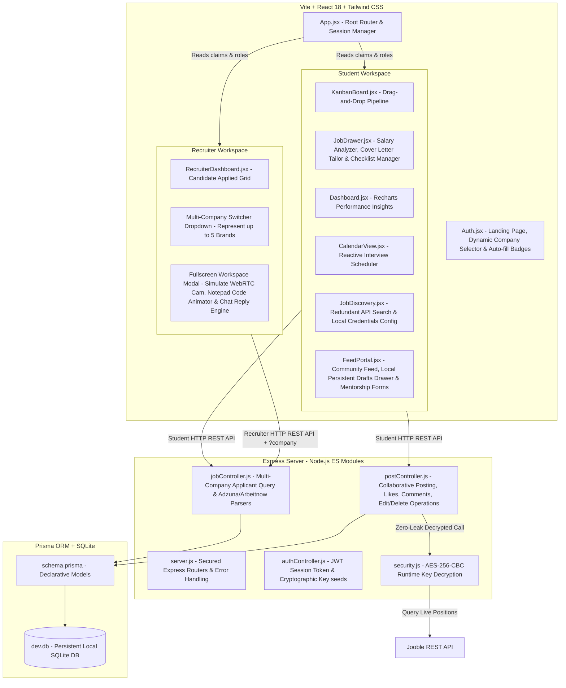

# 🚀 JobTrack - Premium Career Funnel & Community Network

**JobTrack** is an ultra-premium, production-grade monorepo web platform engineered to bridge the gap between ambitious student developers and verified talent recruiters. Driven by the signature visual aesthetics of modern professional networks, JobTrack replaces archaic job spreadsheets with elegant drag-and-drop pipelines, real-time visual analytics, cover letter compilers, cryptographic API credential layers, and a collaborative community social feed.

> [!IMPORTANT]
> **Signature Theme Palette:** Fully configured using Apna-inspired professional tokens: **Jungle Green (`#2BB794`)** for success actions and verified tags, **Goldenrod (`#FFD167`)** for alert warnings and live sourced indicators, and deep **Voodoo slate linear gradients** for glassmorphic dark-theme components.

---

## 🛠️ Full-Stack System Architecture



---

## 🎨 Dual-Portal Core Features Walkthrough

### **1. 🎓 Student Professional Suite**
* **Interactive Active Job Funnel (Kanban)**: Seamlessly drag-and-drop applications across five custom stages (`APPLIED`, `CONTACTED`, `INTERVIEWING`, `OFFERED`, `REJECTED`) with optimistic UI client rendering. Features a real-time glassmorphic search engine filtering by position, company, or custom prep notes.
* **🇮🇳 CTC & Indian Income Tax Salary Analyzer**: Input annual packages in lakhs (LPA) inside an "Offered" card details tab. Calculates monthly take-home cash, EPF deductions, and professional tax under the **Indian New Tax Regime**, rendering dynamic breakdown graphics with **Recharts Pie Charts**.
* **📝 cover Letter Tailor & Checklists**: Instantly compiles customized, professional cover letter drafts tailoring your candidate bio to the job's target requirements, highlighting skill sets, and listing missing keywords. Tracks preparation details with modular checklist arrays.
* **📅 Interactive Interview Calendar View**: Tracks scheduled interviews inside a beautiful monthly calendar grid. Clickable interview nodes smoothly slide open the job preparation drawer for quick reference.

### **2. 💼 Multi-Company Recruiter Suite**
* **Represent up to 5 Brands**: Registration limits recruiters to representing a maximum of 5 verified brands. DynamicSwitcher loads metrics and candidates seamlessly inside a glassmorphic dashboard navbar.
* **ATS match Index & Skill Gap Scanner**: Evaluates candidates' resumes against job qualifications, presenting a circular matching index percentage alongside Jungle Green matched skills and warning Goldenrod missing keyword alarms.
* **Fullscreen Workspace & Simulated Interview Arena**: Recruiters can launch virtual interview workspace simulations. Features WebRTC-inspired simulated video streams, evaluative rating logs, an **Interactive Chat Simulator powered by a Smart Conversational Reply Engine**, and a **Shared Notepad Code Animator** that dynamically writes clean, syntactically-styled code blocks character-by-character as the candidate references implementations.

### **3. 💬 Collaborative social Community Feed (Apna-Style UI)**
* **Everyone Can Share**: Restrictive recruiter-only policies have been replaced; both student candidates and recruiter talent partners can publish posts, share DSA prep milestones, or list announcements.
* **Secure Edit & Delete Operations**: Users can easily edit or delete their own posts. Clicking the pencil icon loads text content and linked job tags back into the editor (scrolling smoothly to the top). Clicking the trash can deletes it. 
  > [!CAUTION]
  > **Strict Gating Security**: Frontend buttons are only exposed if `post.userId === currentUserId`. Any mock REST or spoofed requests targeting another user's posts are rejected securely at the API middleware level, returning a `403 Forbidden` response.
* **Local Persistent Drafts drawer**: Type a post and click **"Save Draft"** to cache content locally. Access, edit, or clear your saved works from a beautiful, collapsible glassmorphic drawer powered by `localStorage` persistence that survives browser refreshes and hot restarts.
* **Featured Job Linker & Direct-to-Funnel CTAs**: Link active openings to your social post inside the editor toolbar. When published, other students can click **"Apply Direct"** on the card. This automatically builds the application payload, writes it to the database, and adds it to their Kanban board with integrated **Double Tracking safeguards**.
* **Rohan Sen's Interactive Mentorship Form**: Interactive mentorship broadcasts by Rohan Sen (Google Cloud Director) feature an **inline custom form** allowing students to submit system design, DSA, PM, or ATS resume review requirements with real-time submit loaders.

### **4. 🔍 Live Sourced Job Discovery & Cryptographic Security**
* **Redundancy API Search Engine**: Query live software engineering positions globally. Implements a triple-tiered safety net:
  1. *Tier 1:* Queries live positions via the official **Adzuna API** using a secure local credentials settings config panel.
  2. *Tier 2:* Falls back to a keyless API integration with **Arbeitnow** if Adzuna keys are unconfigured.
  3. *Tier 3:* Falls back to a high-fidelity curated SDE seed list if both public endpoints are slow or offline, ensuring 100% service availability.
* **🔒 AES-256-CBC Environment key Security**: Jooble's live search integration requires cryptographic safety. To prevent API key leaks:
  * The raw key is encrypted using a 256-bit AES key derived dynamically from the server's backend `JWT_SECRET`.
  * Only the secure ciphertext is stored in `backend/.env` under `JOOBLE_API_KEY_SECURE`.
  * The backend controller calls `decryptJoobleKey()` to decrypt the ciphertext in temporary local scope memory during live searches, garbage collecting the raw key immediately after the query to ensure zero leakage in server logs or exceptions.

---

## 🛠️ Step-by-Step Installation & Boot Guide

Getting JobTrack running on your machine takes less than two minutes.

### **1. Install Monorepo Dependencies**
Initialize packages for both the root monorepo, Express backend, and Vite frontend:
```bash
npm run setup
```

### **2. Initialize SQLite Shared Database**
Apply schema migrations and seed initial recruiters and candidate analytics data:
```bash
npm run db:init
```
*This instantly generates your local SQLite database file `dev.db` inside `backend/prisma/`. Zero database server installation or configuration is required!*

### **3. Start Development Servers**
Launch both servers concurrently:
```bash
npm run dev
```
Open **[http://localhost:5173](http://localhost:5173)** in your browser to start tracking and networking!

---

## 🔑 Demo Account Credentials

You can effortlessly log in and explore both sides of the platform using these pre-seeded demo accounts:

| Role | Username / Email | Password | Represented Companies / Features |
| :--- | :--- | :--- | :--- |
| **🎓 Student (Candidate)** | `demo@jobtrack.com` | `password` | **Akash Das** (Has Kanban card layouts, monthly calendar bookings, Cover Letter metrics, and persistent feed drafts) |
| **🎓 Student 2 (Candidate)** | `student2@jobtrack.com` | `password` | **Priyanjali Sen** (Pre-seeded SDE Intern applicant profiles) |
| **💼 Recruiter (5-Company)** | `recruiter@jobtrack.com` | `password` | **Siddharth Malhotra** (Represents Google, Swiggy, Stripe, CRED, and Zomato. Toggling brands dynamically shifts dashboard analytics and fullscreen workspaces) |

---

## 📂 Project Directory Structure

```text
/project-root
  ├── package.json              <-- Monorepo entry scripts (setup, dev, db:init)
  ├── backend/
  │    ├── prisma/
  │    │    ├── schema.prisma   <-- Declarative unified DB schema (SQLite / SQLite-to-Postgres)
  │    │    └── dev.db          <-- Generated local SQLite database file
  │    ├── src/
  │    │    ├── controllers/    <-- API Handlers (Auth, Jobs CRUD, Social Feed Edit/Delete)
  │    │    ├── middleware/     <-- JWT Authentication token validator
  │    │    ├── utils/          <-- AES security decryptors, mock seeder scripts
  │    │    └── server.js       <-- Express main bootstrapper mounting Cors and API routes
  │    └── package.json
  ├── frontend/
  │    ├── src/
  │    │    ├── components/     <-- Modular React elements (FeedPortal, RecruiterDashboard, Auth)
  │    │    ├── App.jsx         <-- Tab router and authentication state manager
  │    │    ├── App.css         <-- Styling animations and visual classes
  │    │    ├── index.css       <-- CSS tokens, custom scrollbars, and glassmorphic designs
  │    │    └── main.jsx
  │    ├── index.html
  │    └── package.json
  └── README.md
```

---

## 🏆 Resume Talking Points for Job Seekers

If you feature this project on your portfolio or resume, here are the key technical concepts you can highlight to impress engineering managers:

1. **Cryptographic Security & Environment Hardening**: Implemented **AES-256-CBC encryption algorithms** utilizing key derivation functions from `JWT_SECRET` to secure third-party API credentials, building zero-leak in-memory decryption layers that prevent key disclosure inside diagnostic environment logs or crash reports.
2. **Dual-Role RBAC & Data Isolation**: Configured custom **JSON Web Token (JWT) claims** and validation middleware, implementing fine-grained Role-Based Access Controls (RBAC) separating student CRUD tasks from recruiter dashboards, securing multi-tenant data boundaries.
3. **Database-Agnostic Schema Modeling**: Engineered modular database schemes using **Prisma ORM** mapping onto local SQLite databases for development and instantly swapping to production-grade PostgreSQL engines with zero code adjustments.
4. **Persistent Client-Side Caching**: Structured a local **Drafts caching system** relying on browser `localStorage` serialization, preventing data loss across hot reloads and network loss while minimizing backend API payloads.
5. **Optimistic UI Client State Sync**: Structured React state handlers to complete **optimistic UI updates** during high-interaction operations (such as Kanban dragging and post reactions), updating local state grids immediately and syncing with asynchronous server databases in the background.
